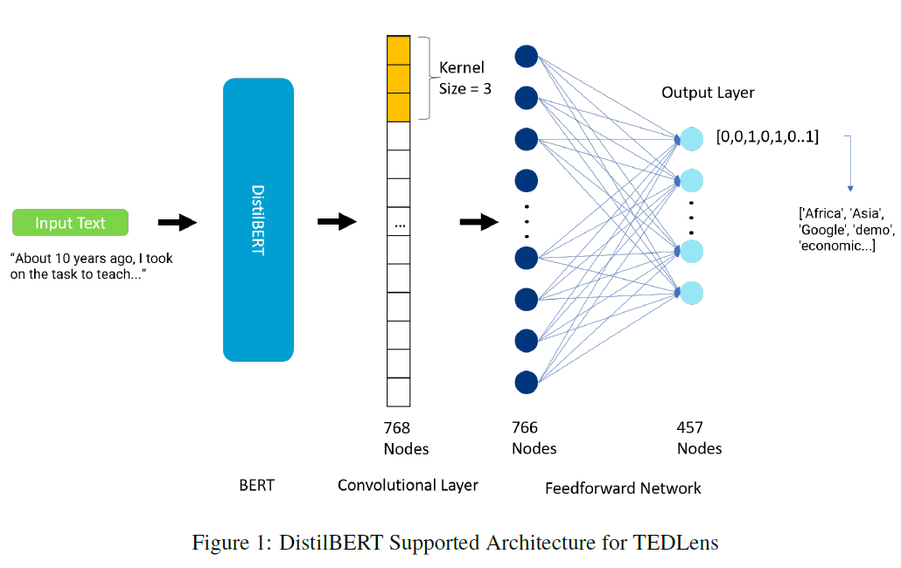

# TEDLens : Elevating TED Talk Recovery
## Abstract
TED Talks, known for their wealth of knowledge and diverse ideas, continue to serve as an invaluable resource for students and researchers across various domains. Whether used as a foundational resource or for the in-depth exploration of technical concepts, these talks remain a wellspring of inspiration and wisdom. Our aim is to harness the power of Natural Language Processing (NLP) techniques to extract valuable insights from the transcripts and descriptions of these talks.

## Dataset Credits
Dataset - [Link to Dataset](https://www.kaggle.com/datasets/miguelcorraljr/ted-ultimate-dataset)

## Trained Models

